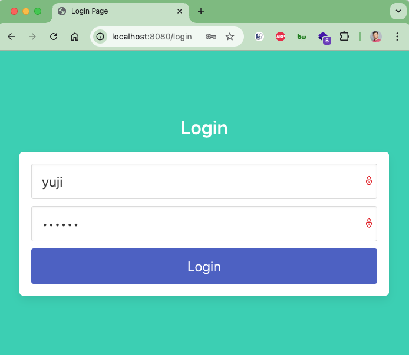
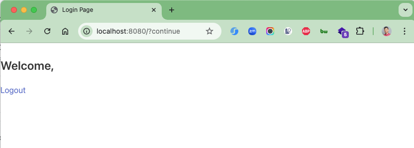

# spring-boot-multi-authenticate

Example demo Multi Authenticate with Spring boot 3 and Spring security

### Things to do list:

1. Clone this repository: `git clone https://github.com/hendisantika/spring-boot-multi-authenticate.git`
2. Navigate to the folder: `cd spring-boot-multi-authenticate`
3. Run the application: `mvn clean spring-boot:run`
4. Open your favorite browser: http://localhost:8080

### # information to demo

- Username: yu71
- Password: 53cret
- Api key: jujutsu.kaisen

### Not Using API Key:

```shell
// 20250406071910
// http://localhost:8080/api/internal/health

{
  "message": "SC_UNAUTHORIZED"
}
```

### Using API Key:

```shell
curl --location 'http://localhost:8080/api/internal/health' \
--header 'x-api-key: jujutsu.kaisen'
```

### Image Screenshots

Login Page



Home Page


